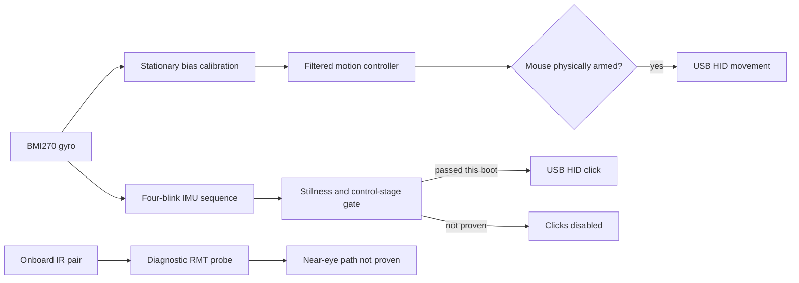

# Colibrino


Colibrino is an open-source, do-it-yourself head mouse for people who cannot
comfortably use a conventional mouse. Head movement controls the pointer and an
intentional blink provides the primary click.

Colibrino é um mouse de cabeça open source e faça-você-mesmo. O projeto busca
ampliar o acesso ao computador para pessoas com deficiências motoras, incluindo
tetraplegia, artrogripose, amputações e paralisia cerebral.

> **Accessibility safety:** unintended movement, false clicks, stuck buttons,
> and unsafe sensor power can have real consequences. The StickS3 firmware is
> deliberately locked at boot. Physical USB and head-motion tests pass; blink
> clicking remains disabled until its stricter validation succeeds.

## Project status

| Target | Hardware | Click sensor | Status |
| --- | --- | --- | --- |
| Legacy | Arduino Leonardo or Pro Micro, MPU6050 | External TCRT5000 | Historical working implementation; preserved under `arduino project/` |
| StickS3 | M5Stack StickS3 with internal BMI270 | Experimental BMI270 blink gesture; optional future TCRT5000 | Composite USB, BMI270, controls, and head pointer verified on hardware; safe blink input still under validation |

The StickS3 port is the active development path. It does not replace or modify
the legacy AVR firmware.

## What the StickS3 port provides

The new implementation uses the built-in BMI270 for pointer motion and native
USB for composite diagnostic CDC plus HID mouse operation. Both interfaces,
stationary calibration, the controls, and head-driven cursor movement have run
on a real StickS3. It starts with mouse reports locked and the IR power rail off;
a physical two-second hold is required before any mouse report can be emitted.

The built-in IR receiver is a digital demodulating remote-control receiver, not
the analog reflectance channel used by the original TCRT5000. Real near-eye
tests did not produce separable eyelid data, and M5Stack specifies at least
30 cm between its transmitter and receiver. The source retains the diagnostic
probe, but onboard IR is not recommended as a near-eye click path.

The current no-purchase experiment instead recognizes a deliberate four-blink
rhythm from tiny BMI270 motion transferred through firmly mounted glasses. It
requires two seconds without pointer-scale rotation, rejects shorter sequences,
and must produce at least two intended sequences with zero events during normal
blinking and head motion before clicking becomes available. It has not yet met
that complete hardware gate.

Authenticated Wi-Fi OTA is now part of the StickS3 application whenever its
ignored local secrets header is present. It deliberately reuses the tested
unit's established `sticks3-ptt.local` identity, locks HID and external IR power
before accepting an update, and refuses the uploader when the resolved MAC does
not match the saved Colibrino StickS3. The currently installed older Colibrino
test image has no OTA listener, so one cable bootstrap is still required; later
firmware iterations can be delivered over Wi-Fi.



## Quick start for developers

The commands below build and test without uploading anything. Run them from
`sticks3/`:

```sh
platformio test -e native
platformio run -e m5stack-sticks3
```

After the one-time OTA bootstrap, an authenticated update is:

```sh
./scripts/upload_ota.sh
```

The simulator gate requires the Wokwi CLI and `WOKWI_CLI_TOKEN` in the process
environment or the repository's ignored `.env`:

```sh
./scripts/run_wokwi.sh
```

A successful run prints `COLIBRINO_SIM_PASS`. See the complete
[StickS3 guide](./sticks3/README.md), the machine-readable
[port plan](./sticks3/PORT_PLAN.json), and the contributor context in
[AGENTS.md](./AGENTS.md).

## What simulation proves

No currently available tool emulates the complete StickS3.

| Tool | Useful for | Does not prove |
| --- | --- | --- |
| [Wokwi generic ESP32-S3](https://docs.wokwi.com/guides/esp32) | Cross-compiled motion and blink logic running on a simulated ESP32-S3 | StickS3 peripherals, optics, or composite USB |
| [M5Stack LVGL emulator](https://github.com/m5stack/lv_m5_emulator) | Native desktop UI and display-layout work | ESP32-S3 execution, StickS3 sensors, power, IR, or USB |
| [Espressif QEMU](https://docs.espressif.com/projects/esp-idf/en/v5.5/esp32s3/api-guides/tools/qemu.html) | ESP32-S3 CPU, memory, and selected SoC peripherals | Complete StickS3 board behavior or eye reflection |
| [UiFlow2](https://docs.m5stack.com/en/uiflow2/sticks3/program) | UI design and deployment to a connected StickS3 | Hardware-free execution |

Simulation still cannot establish board-specific behavior. Those boundaries
were tested on hardware, while future changes to buttons, M5PM1 power, BMI270
timing, USB, or mounting geometry still require another physical regression run.

## Current click-sensor decision

Two high-rate glasses-mounted captures now provide the tuning corpus. The first
contains three recognizable deliberate four-blink sequences and no still/head
events. The second, deliberately harder run contains no events in ordinary
blinking or head motion after conservative offline retuning, but only one
recognized intentional sequence. Because the firmware requires two, the result
correctly remains `NOT_PROVEN` and cannot click.

Repeat the guided IMU test on the fixed mount before buying anything. If the
four-blink gesture cannot repeatedly pass without control-stage events, add an
analog reflectance sensor such as the TCRT5000 through the existing
sensor-neutral input boundary. The integrated IR pair itself is no longer the
recommended alternative.

## Legacy build

The original implementation is retained for existing builds. It targets an
Arduino Leonardo or ATmega32U4 Pro Micro connected to an MPU6050 and TCRT5000.
Open `arduino project/Colibrino/Colibrino.ino` in Arduino IDE, choose the
Leonardo-compatible board, install the TimerOne dependency, and upload.

Leave the assembled device still during its one-time gyro calibration. If the
cursor drifts because calibration was performed while moving, upload the sketch
under `LimparCalibracao/`, then restore the main firmware and calibrate again.

### Legacy materials

| Item | Purpose |
| --- | --- |
| Arduino Leonardo or Pro Micro | ATmega32U4 board with native USB mouse support |
| MPU6050 | Head-motion accelerometer and gyroscope |
| TCRT5000 | Pulsed infrared blink-reflection sensor |
| Perfboard or breadboard | Circuit assembly |
| Resistors, LEDs, and optional buzzer | Sensor bias, current limiting, and feedback |
| Six-conductor cable and USB cable | Sensor and host connections |
| Glasses frame | Mechanical mounting |


| Arduino pin | Connection |
| --- | --- |
| VCC and GND | MPU6050 and TCRT5000 power |
| GPIO 15 | TCRT5000 IR emitter through a 180-330 ohm resistor |
| A0 | TCRT5000 phototransistor signal |
| GPIO 16 | Legacy indicator/buzzer connection |

The original Portuguese video tutorial remains available on
[YouTube](https://www.youtube.com/watch?v=DUF2yonN9Ps).

## Repository map

| Path | Responsibility |
| --- | --- |
| `sticks3/` | Guarded StickS3 firmware, tests, Wokwi harness, and validation plan |
| `arduino project/Colibrino/` | Original AVR firmware |
| `LimparCalibracao/` | Legacy EEPROM calibration reset utility |
| `3d models/` | Printable enclosure assets |
| `doc/` | Assembly images |
| `PROJECT_KNOWLEDGE.md` | Durable architectural and historical context for future development sessions |

## Community and license

Share builds and questions in the
[Colibrino Google Group](https://groups.google.com/g/colibrino). Historical
frequently asked questions are available in the
[community FAQ](https://docs.google.com/document/d/1n8rUOnNmSkuknlO98TbDd7EEdKiDvEBH_lRSuz5WyO0/edit?usp=sharing).

Colibrino is free software distributed under the
[GNU General Public License version 3 or later](./LICENSE), without warranty.
