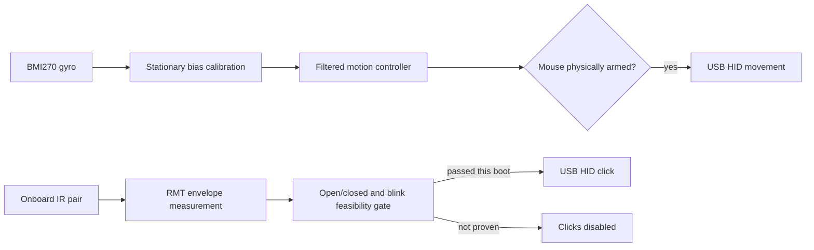

# Colibrino


Colibrino is an open-source, do-it-yourself head mouse for people who cannot
comfortably use a conventional mouse. Head movement controls the pointer and an
intentional blink provides the primary click.

Colibrino é um mouse de cabeça open source e faça-você-mesmo. O projeto busca
ampliar o acesso ao computador para pessoas com deficiências motoras, incluindo
tetraplegia, artrogripose, amputações e paralisia cerebral.

> **Accessibility safety:** unintended movement, false clicks, stuck buttons,
> and unsafe sensor power can have real consequences. The StickS3 firmware is
> deliberately locked at boot and has not yet completed physical-device
> validation.

## Project status

| Target | Hardware | Click sensor | Status |
| --- | --- | --- | --- |
| Legacy | Arduino Leonardo or Pro Micro, MPU6050 | External TCRT5000 | Historical working implementation; preserved under `arduino project/` |
| StickS3 | M5Stack StickS3 with internal BMI270 | Onboard IR experiment; optional future TCRT5000 | Implemented, host-tested, ESP32-S3-simulated, and build-verified; fresh-device testing pending |

The StickS3 port is the active development path. It does not replace or modify
the legacy AVR firmware.

## What the StickS3 port provides

The new implementation uses the built-in BMI270 for pointer motion and native
USB for composite diagnostic CDC plus HID mouse operation. It starts with mouse
reports locked and the IR power rail off. Physical two-second holds are required
to arm either potentially unsafe operation.

The built-in IR receiver is a digital demodulating receiver, not the analog
reflectance channel used by the original TCRT5000. The firmware therefore runs a
guided experiment before allowing blink-generated clicks. No external sensor
purchase is recommended until that experiment is completed on the fresh board.



## Quick start for developers

The commands below build and test without uploading anything. Run them from
`sticks3/`:

```sh
platformio test -e native
platformio run -e m5stack-sticks3
```

The simulator gate requires the Wokwi CLI and `WOKWI_CLI_TOKEN` in the process
environment or the repository's ignored `.env`:

```sh
./scripts/run_wokwi.sh
```

A successful run prints `COLIBRINO_SIM_PASS`. See the complete
[StickS3 guide](./sticks3/README.md), the machine-readable
[port plan](./sticks3/PORT_PLAN.json), and the contributor context in
[AGENTS.md](./AGENTS.md).

## What simulation proves

No currently available tool emulates the complete StickS3.

| Tool | Useful for | Does not prove |
| --- | --- | --- |
| [Wokwi generic ESP32-S3](https://docs.wokwi.com/guides/esp32) | Cross-compiled motion and blink logic running on a simulated ESP32-S3 | StickS3 peripherals, optics, or composite USB |
| [M5Stack LVGL emulator](https://github.com/m5stack/lv_m5_emulator) | Native desktop UI and display-layout work | ESP32-S3 execution, StickS3 sensors, power, IR, or USB |
| [Espressif QEMU](https://docs.espressif.com/projects/esp-idf/en/v5.5/esp32s3/api-guides/tools/qemu.html) | ESP32-S3 CPU, memory, and selected SoC peripherals | Complete StickS3 board behavior or eye reflection |
| [UiFlow2](https://docs.m5stack.com/en/uiflow2/sticks3/program) | UI design and deployment to a connected StickS3 | Hardware-free execution |

The fresh StickS3 remains required to validate the BMI270 mounting axes,
M5PM1-controlled power, onboard IR optical response, buttons, display, and
native USB CDC/HID enumeration.

## Fresh-device decision gate

Test the integrated IR path twice at the intended eye distance under different
ambient lighting. Each run uses five deliberate blinks. Keep the onboard sensor
only if each run detects at least four of five blinks and a 30-second open-eye
control produces no false click.

If the signal remains inseparable, recall stays below four of five after
positioning trials, or the open-eye control produces false clicks, add an analog
reflectance sensor such as the TCRT5000 through the existing sensor-neutral
input boundary.

## Legacy build

The original implementation is retained for existing builds. It targets an
Arduino Leonardo or ATmega32U4 Pro Micro connected to an MPU6050 and TCRT5000.
Open `arduino project/Colibrino/Colibrino.ino` in Arduino IDE, choose the
Leonardo-compatible board, install the TimerOne dependency, and upload.

Leave the assembled device still during its one-time gyro calibration. If the
cursor drifts because calibration was performed while moving, upload the sketch
under `LimparCalibracao/`, then restore the main firmware and calibrate again.

### Legacy materials

| Item | Purpose |
| --- | --- |
| Arduino Leonardo or Pro Micro | ATmega32U4 board with native USB mouse support |
| MPU6050 | Head-motion accelerometer and gyroscope |
| TCRT5000 | Pulsed infrared blink-reflection sensor |
| Perfboard or breadboard | Circuit assembly |
| Resistors, LEDs, and optional buzzer | Sensor bias, current limiting, and feedback |
| Six-conductor cable and USB cable | Sensor and host connections |
| Glasses frame | Mechanical mounting |


| Arduino pin | Connection |
| --- | --- |
| VCC and GND | MPU6050 and TCRT5000 power |
| GPIO 15 | TCRT5000 IR emitter through a 180-330 ohm resistor |
| A0 | TCRT5000 phototransistor signal |
| GPIO 16 | Legacy indicator/buzzer connection |

The original Portuguese video tutorial remains available on
[YouTube](https://www.youtube.com/watch?v=DUF2yonN9Ps).

## Repository map

| Path | Responsibility |
| --- | --- |
| `sticks3/` | Guarded StickS3 firmware, tests, Wokwi harness, and validation plan |
| `arduino project/Colibrino/` | Original AVR firmware |
| `LimparCalibracao/` | Legacy EEPROM calibration reset utility |
| `3d models/` | Printable enclosure assets |
| `doc/` | Assembly images |
| `PROJECT_KNOWLEDGE.md` | Durable architectural and historical context for future development sessions |

## Community and license

Share builds and questions in the
[Colibrino Google Group](https://groups.google.com/g/colibrino). Historical
frequently asked questions are available in the
[community FAQ](https://docs.google.com/document/d/1n8rUOnNmSkuknlO98TbDd7EEdKiDvEBH_lRSuz5WyO0/edit?usp=sharing).

Colibrino is free software distributed under the
[GNU General Public License version 3 or later](./LICENSE), without warranty.
