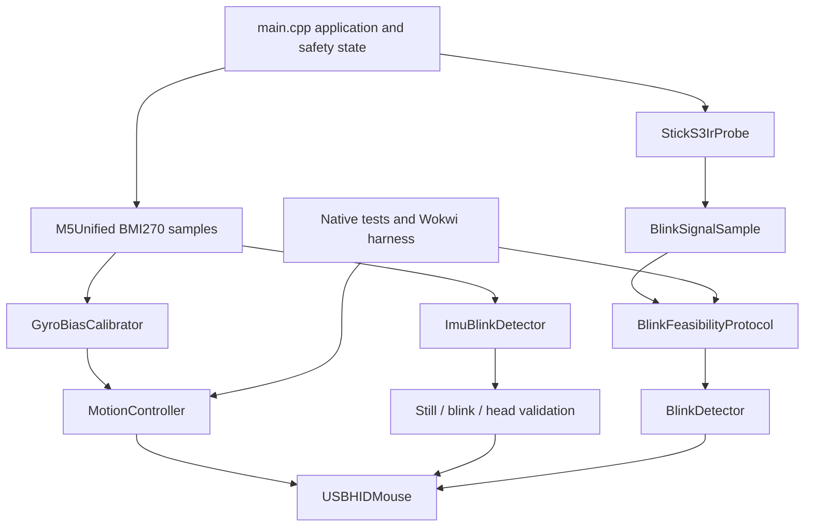

# Colibrino for M5Stack StickS3

This directory contains a guarded ESP32-S3 successor to the legacy AVR head
mouse. It uses the StickS3's internal BMI270 for pointer movement, native USB
CDC plus HID for diagnostics and mouse reports, a conservative IMU blink-gesture
experiment, and a retained diagnostic probe for the onboard IR pair.

The code has run on a real StickS3 after an 8 MB recovery backup was captured.
USB, display, buttons, BMI270 calibration, and head-controlled pointer motion
are verified. Click sensing remains experimental and fails closed.

## Current evidence

| Area | Status | Evidence |
| --- | --- | --- |
| Portable motion and blink logic | Passing | Thirteen native Unity tests |
| Generic ESP32-S3 execution | Passing | Wokwi CLI boots the cross-compiled image and reports eleven checks plus `COLIBRINO_SIM_PASS` |
| Production firmware build | Passing | Pinned PlatformIO environment links composite CDC/HID firmware |
| StickS3 display, buttons, and BMI270 | Passing on tested unit | BMI270 detected and calibrated; large blue Button A and status display exercised |
| Native USB and head pointer | Passing on tested unit | Composite CDC/HID enumerated; stationary armed control emitted no reports; worn head motion moved the cursor |
| Authenticated OTA | Passing on tested unit | One cable bootstrap and three authenticated uploads passed at `sticks3-ptt.local`; the first two round trips returned locked and calibrated |
| Onboard IR eyelid response | Rejected for near-eye use | Guided tests were inseparable; M5Stack specifies at least 30 cm TX/RX spacing |
| IMU blink gesture | Pending new-pattern hardware gate | Even four-blink timing produced still-control events; double-pause-double replays retained controls cleanly but is not yet worn-tested |
| Need for external TCRT5000 | Deferred | Buy only if repeat IMU validation remains unusable or unsafe |

Five new worn guided runs rejected every head-motion control, but the former
evenly spaced four-blink detector produced three still-control sequences while
recognizing only two intentional sequences. That cadence is unsafe and no
longer accepted. The replacement raises the impulse entry threshold and treats
the four blinks as a temporal code: short gap, 0.8-1.4 second pause, short gap.
Every retained still/head capture replays with zero sequences under this build;
a new worn run must still prove that the intentional code is usable twice.

## Architecture



Board-specific M5Unified, RMT, power, display, button, and USB code stays in
`src/main.cpp` and `src/ir_probe.*`. Motion, optical classification, and the
IMU pattern detector under `include/colibrino/` and their matching sources are
hardware-independent. `tools/replay_imu_capture.cpp` runs captured device CSV
through the exact production detector.

The application also owns optional Wi-Fi and ArduinoOTA. OTA is compiled only
when ignored `include/colibrino_secrets.h` exists. Starting an update locks HID,
releases mouse buttons, invalidates the current blink gate, cancels capture, and
forces external 5 V off before the updater takes control of the loop.

Future v2 work is coordinated with `/Users/fcavalcanti/dev/oracle-loop`, but the
current hardware-proven application remains the control and regression
baseline. New DSP and `AccessIntent` units must stay pure and host-testable.
Luos-compatible message adapters may be built later, but Luos is not yet a
production dependency and may never own HID authorization or release-all. The
exact conditional-adoption evidence and diagnostic spike are in
[`docs/LUOS_ARCHITECTURE_DECISION.md`](../docs/LUOS_ARCHITECTURE_DECISION.md).

## Safe build and test

Install PlatformIO, then run from this directory:

```sh
platformio test -e native
platformio run -e m5stack-sticks3
```

These commands do not upload firmware. Before any upload, identify the exact
serial port, preserve the existing flash when it belongs to another project,
and keep recovery images and logs under ignored `.device-backups/`.

The production build pins `espressif32@6.12.0` and `M5Unified@0.2.19`. It uses
native TinyUSB mode because hardware USB-JTAG CDC mode cannot host the required
composite HID mouse interface.

## Authenticated OTA

The tested StickS3 was originally the `sticks3-ptt` terminal, whose established
firmware already used authenticated ArduinoOTA. Colibrino preserves that
physical device's Wi-Fi credentials, OTA password, and `sticks3-ptt.local`
identity through an ignored local header. Copy the example only when preparing
a different device:

```sh
cp include/colibrino_secrets.h.example include/colibrino_secrets.h
```

Never commit the resulting header. The repository-root ignored `.env` must set
`COLIBRINO_OTA_SECRETS`, `COLIBRINO_OTA_HOST`, and
`COLIBRINO_OTA_EXPECTED_MAC`. The upload wrapper builds first, resolves the
hostname, checks the ARP MAC against the expected StickS3, and then invokes
Espressif's authenticated OTA tool:

```sh
./scripts/upload_ota.sh
```

The wrapper explicitly refuses a different S3 such as
`bedside-countdown-s3`. OTA updates firmware; they do not provide wireless HID
or replace USB CDC diagnostics. The one-time cable bootstrap was completed on
2026-08-15. Two subsequent authenticated round trips succeeded, each resolving
to MAC `AC:27:6E:D2:68:B8`; after each reboot CDC reported HID locked, external
IR off, BMI270 calibrated, blink clicks disabled, and OTA ready. Subsequent
Colibrino builds can use OTA while the device is awake and on the same LAN. A
third authenticated upload installed the double-pause-double build; its upload
completed before USB was disconnected, while another CDC post-reboot check
remains pending.

## Voice and wireless research boundary

StickS3 contains an ES8311 codec, microphone, speaker, 8 MB PSRAM, and an
ESP32-S3 capable of local WakeNet and MultiNet recognition. M5Stack's Xiaozhi
image proves wake-word operation on this board, but Colibrino has not yet
compiled, installed, or physically validated speech recognition.

Voice work must begin in a separate PlatformIO environment. The validated
production build is pinned to Arduino-ESP32 2.0.17, while the current Arduino
`ESP_SR` wrapper belongs to 3.x. The existing 8 MB layout has dual OTA slots and
no model partition, so actual application and model artifacts must be measured
before choosing a new layout. A partition-table change cannot be delivered by
ordinary OTA and requires one explicitly authorized cable flash.

The intended interaction is wake phrase, pointer freeze, short offline command
window, guarded action, then resume. Speech producers must recommend an
`AccessIntent`; only the application safety layer may emit HID. Voice is not a
replacement for blink, dwell, or an external adaptive switch. BLE HID and a
maintenance-only Wi-Fi mode are required before treating the prototype as a
cable-free wearable. ESP32-S3 does not provide Bluetooth LE Audio, so using the
StickS3 as a normal Bluetooth microphone is out of scope.

The complete evidence, Apple accessibility integration, compact optical-sensor
candidates, Nicla Voice alternative, acceptance gates, and staged plan live in
[`docs/ACCESSIBILITY_WEARABLE_STUDY.md`](../docs/ACCESSIBILITY_WEARABLE_STUDY.md).

## Wokwi simulator gate

Wokwi uses a generic ESP32-S3 DevKitC rather than a complete StickS3 model. The
harness executes the production portable sources and verifies stationary gyro
calibration, moving-calibration rejection, pointer deadzone, direction and
fractional accumulation, invalid-timestep rejection, signal separation, blink
duration and refractory timing, the double-pause-double IMU pattern, rejection
of uniform blinking, motion cancellation, and the guided feasibility state
machine.

Install the Wokwi CLI and place the credential in the ignored repository-root
`.env`:

```dotenv
WOKWI_CLI_TOKEN=your_token_here
```

Then run:

```sh
./scripts/run_wokwi.sh
```

If the CLIs are not on `PATH`, point the wrapper to them:

```sh
PLATFORMIO_CLI_BIN=/path/to/platformio \
WOKWI_CLI_BIN=/path/to/wokwi-cli \
./scripts/run_wokwi.sh
```

The script builds `wokwi-esp32s3`, lints `diagram.json`, boots `firmware.bin`,
fails on `COLIBRINO_SIM_FAIL`, and succeeds only after
`COLIBRINO_SIM_PASS` appears on the simulated UART.

## Simulator boundary

No public tool currently provides a complete StickS3 emulator.

| Tool | Actual scope | Why it is insufficient here |
| --- | --- | --- |
| [Wokwi](https://docs.wokwi.com/guides/esp32) | Generic ESP32-S3 CPU and configurable virtual components | No complete StickS3, BMI270/M5PM1 model, onboard IR optics, or exact TinyUSB behavior |
| [M5Stack `lv_m5_emulator`](https://github.com/m5stack/lv_m5_emulator) | M5GFX/LVGL UI compiled as a native SDL desktop application | Its current targets omit StickS3 and it does not emulate the ESP32-S3 or board peripherals |
| [UiFlow2](https://docs.m5stack.com/en/uiflow2/sticks3/program) | UI editor plus code deployment to a connected device | `Run Once` executes on physical hardware |
| [Espressif QEMU](https://docs.espressif.com/projects/esp-idf/en/v5.5/esp32s3/api-guides/tools/qemu.html) | ESP32-S3 CPU, memory, and selected SoC peripherals | No StickS3 external devices or eyelid-reflection model |

The emulator evidence was useful but could not answer whether the onboard IR
pair sees an eyelid. Physical near-eye measurements have now rejected that path;
simulation remains unable to replace future hardware regression tests.

## Safety model

The firmware fails closed:

1. It boots in IR diagnostic mode with the M5PM1-controlled external 5 V output
   disabled.
2. Mouse movement remains locked until BMI270 calibration succeeds, mouse mode
   is selected, and button A is held for two seconds.
3. IMU blink clicks remain disabled unless the current mount passes stillness,
   deliberate-sequence, and head-motion controls during the current boot.
4. The detector requires double blink, 0.8-1.4 second pause, double blink;
   rejects uniformly spaced blinking; and waits two quiet seconds after any
   pointer-scale head rotation.
5. Invalid IMU timing produces no pointer delta.
6. IR initialization failure immediately disables the external 5 V output.

### External 5 V warning

The onboard IR pair is powered through the controlled EXT_5V path. Never enable
StickS3 external output while another source drives EXT_5V, Grove power, or an
attached accessory rail. Before holding the large blue button to enable IR,
disconnect all external 5 V sources. Disable IR again before changing wiring.

The internal microphone and speaker are disabled. M5Stack specifies that the
speaker amplifier interferes with IR reception, so startup explicitly clears
the amplifier-enable output as well.

## Controls

The physically verified large blue button is the only application control. The
side power/reset control is not part of the Colibrino workflow.

| Mode | Large blue button |
| --- | --- |
| IR probe, power off | Tap: motion monitor; hold 2 seconds: enable IR after confirming no external 5 V source |
| IR probe, power on | Tap: start/repeat guided test; hold 2 seconds: disable IR |
| Motion monitor, idle/result | Tap: start/repeat IMU validation; hold 2 seconds: mouse mode |
| Mouse, locked | Tap: IR mode; hold 2 seconds after calibration: arm output |
| Mouse, armed | Hold 2 seconds: lock output |

M5Unified's hold threshold is explicitly matched to Colibrino's two-second
action, so every shorter release remains a reliable tap. The mouse cannot leave
mouse mode while armed. Lock it first.

## Diagnostic output

USB CDC runs at 115200 baud and is write-only: the firmware reads nothing from
the host, and the large blue Button A is the sole application input. After an
authorized upload, monitor with:

```sh
platformio device monitor --baud 115200
```

When the OTA build is configured and Wi-Fi is associated, the same diagnostics
stream is mirrored to a read-only TCP port (35533, advertised as
`colibrino-diag._tcp`): one client at a time, inbound bytes discarded, oldest
lines dropped with an explicit `EVENT,TELEMETRY,DROPPED,<total>` counter when
the link stalls. Boot prints `EVENT,BUILD,<sha>`, a client is greeted with
`EVENT,TELEMETRY,CONNECTED,<sha>`, and the 1 Hz `STATUS` record ends with
`build=<sha>,batt=<pct>,tele=<0|1>`. Worn trace capture runs cable-free over
this mirror (`tools/capture_session.py --tcp`; see
`../docs/V2_TRACE_CAPTURE_PROTOCOL.md`) because a USB cable is a physical
anchor on the head mount; the USB path stays available for bench diagnostics.
The stream is unauthenticated on the trusted home LAN - a LAN peer can read
head-motion telemetry while the port is up; no credential ever appears in it.
Monitor-only capture never writes to the port or socket and never uploads.

A one-hertz `STATUS` record repeats the detected board, mode, arming state,
BMI270/calibration state, IMU-blink validation, IR state, OTA state, both
protocol stages, and raw gyro values. This remains available even when one-time
boot messages occurred before CDC opened.

IR frames use this CSV schema:

```text
IR,ms,valid,symbols,active_us,total_us,ratio,stage
```

The final record reports open/closed means, separation sigma, relative change,
valid frame counts, and detected blinks:

```text
RESULT,PASS|NOT_PROVEN,open=...,closed=...,sigma=...,change=...,open_frames=...,closed_frames=...,blink_frames=...,blinks=...
```

Retain the complete logs from each physical run. A display `PASS` is the
firmware's minimum signal gate; the purchase decision below is stricter.

IMU capture records use:

```text
IMU,ms,usec,stage,gx_dps,gy_dps,gz_dps,ax_g,ay_g,az_g
RESULT,IMU_BLINK,PASS|NOT_PROVEN,still=...,blink=...,head=...
```

Replay an ignored capture without touching hardware:

```sh
c++ -std=c++17 -Iinclude tools/replay_imu_capture.cpp \
  src/imu_blink_detector.cpp -o /tmp/colibrino-replay
/tmp/colibrino-replay .device-backups/logs/device-monitor.log
```

A device log may hold several guided probe sessions. The tool splits them on
`EVENT,IMU_PROBE_STARTED` (fallback: a still block that follows a head block),
prints one block per session with the firmware's own predicate
(`RESULT=PASS` only for still 0 / blink >= 2 / head 0), then
`SUMMARY sessions=N controls_clean=yes|no validation_passes=K`. Exit 0 means
"parsed and every control stage clean" (never "physically validated");
1 = a control-stage sequence occurred; 2 = parse failure or no sessions;
`--require-validation [N]` adds exit 3 when fewer than N sessions pass
(default 2). `--events` prints per-session `EVENT,<session>,<stage>,<ms>,IMPULSE|SEQUENCE`
lines for cross-checking with the v2 host tests. Worn acceptance selects
designated runs by ID in the capture tooling; the replay exit code alone never
decides it.

## Hardware validation

Upload only after identifying the board and its serial port explicitly.
Keep the board motionless until the motion screen reports `READY`.

Fresh v2 trace fixtures are captured with this same firmware and no upload:
follow `../docs/V2_TRACE_CAPTURE_PROTOCOL.md` (multi-run matrix inside the
guided 6/15/12 s stages, deliberate gestures only during `BLINK_FIRMLY`,
per-session caps, acceptance by designated run ID).

For the IMU click gate, mount the device firmly in its intended position. Tap
Button A from motion mode, then follow all three measured stages:

1. Keep the head still and blink normally. Any sequence is a failed control.
2. Perform this coded pattern twice: two firm blinks close together, wait about
   one second, then two firm blinks close together. Pause before repeating.
3. Move the head left, right, up, and down as in normal pointer use. Any
   sequence is a failed control.
4. Accept `PASS` only with zero still events, at least two deliberate events,
   and zero head-motion events. Repeat after remounting before enabling HID.

The onboard IR test is retained for engineering diagnosis, not recommended for
eye-facing use. If it is intentionally bench-tested at M5Stack's documented
distance:

1. Confirm no external source is driving EXT_5V or an attached power rail.
2. Enter IR mode and hold the large blue button for two seconds to enable the onboard pair.
3. Align the transmitter and receiver at least 30 cm apart; do not aim an
   undocumented emitter at an eye.
4. Tap the large blue button and follow the open-eye, closed-eye, and repeated-blink stages.
5. Attempt five deliberate blinks and save the complete CDC log.
6. Hold the eye open normally for 30 seconds and confirm that no click occurs.
7. Disable IR before repositioning or changing any connection.
8. Repeat under a different ambient-light condition.

Validate cursor axes and signs using the motion monitor on the final glasses
mount. Do not assume the source defaults match the physical orientation.

## TCRT5000 decision

Do not buy a TCRT5000 solely because the onboard IR pair failed: the no-extra-
hardware IMU pattern still deserves one focused repeat validation. Add an analog
reflectance adapter when the coded gesture cannot pass consistently, is
too tiring, or produces any control-stage event after conservative tuning. The
`BlinkInput` interface already isolates the sensor producer, so an external
adapter does not require rewriting motion control or USB behavior. Electrical
power, resistor values, eye safety, and mounting still require a separate bench
design before connection.

## Source map

| Path | Purpose |
| --- | --- |
| `src/main.cpp` | Board startup, safety state, display, buttons, IMU, CDC, and HID |
| `src/ir_probe.*` | Arduino-ESP32 2.x/3.x RMT transmit and receive adapter |
| `include/colibrino/blink_input.h` | Sensor-neutral normalized blink sample contract |
| `include/colibrino/config.h` | Board pins and tunable motion/IR constants |
| `include/colibrino/imu_blink_detector.h`, `src/imu_blink_detector.cpp` | Allocation-free double-pause-double pattern and head-motion safety gates |
| `include/colibrino/motion_controller.h`, `src/motion_controller.cpp` | Stationary bias estimation and bounded relative-pointer mapping |
| `include/colibrino/signal_analysis.h`, `src/signal_analysis.cpp` | Streaming statistics, calibration gates, blink detector, and guided protocol |
| `test/` | Native Unity regression tests |
| `src/sim_main.cpp` | Deterministic ESP32-S3 Wokwi validation firmware |
| `include/colibrino_secrets.h.example` | Untracked Wi-Fi and OTA configuration template |
| `scripts/upload_ota.sh` | Authenticated OTA build/upload with hostname and hardware-MAC guard |
| `tools/replay_imu_capture.cpp` | Exact production-detector replay of ignored device CSV |
| `diagram.json`, `wokwi.toml` | Wokwi board and firmware configuration |
| `PORT_PLAN.json` | Machine-readable facts, task state, and hardware acceptance criteria |

## Definition of done

A software-only change is ready to hand off when native tests pass, the
production image builds without upload, the Wokwi gate passes when portable
logic changed, `PORT_PLAN.json` remains valid JSON, generated files and secrets
remain untracked, every retained IMU log is replayed after detector tuning,
and every hardware-dependent claim is still labeled as such. Never send a
credential-bearing production image to Wokwi; its simulator environment builds
only the portable `sim_main.cpp` image and must remain isolated from the ignored
OTA header.
