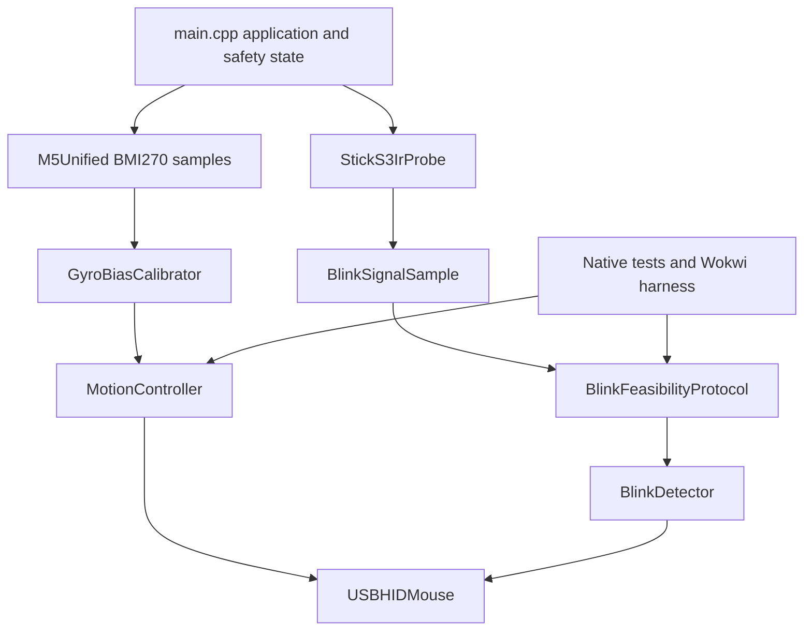

# Colibrino for M5Stack StickS3

This directory contains a guarded ESP32-S3 successor to the legacy AVR head
mouse. It uses the StickS3's internal BMI270 for pointer movement, native USB
CDC plus HID for diagnostics and mouse reports, and an experimental probe for
the onboard IR pair.

The code is implemented and software-validated. It has intentionally not been
uploaded to the StickS3 currently in use. End-to-end hardware validation waits
for the fresh device.

## Current evidence

| Area | Status | Evidence |
| --- | --- | --- |
| Portable motion and blink logic | Passing | Eight native Unity tests |
| Generic ESP32-S3 execution | Passing | Wokwi CLI boots the cross-compiled image and reports eight checks plus `COLIBRINO_SIM_PASS` |
| Production firmware build | Passing | Pinned PlatformIO environment links composite CDC/HID firmware without upload |
| StickS3 display, buttons, and BMI270 | Pending hardware | Requires the fresh device |
| Native USB enumeration and pointer reports | Pending hardware | Requires a host connected to the fresh device |
| Onboard IR eyelid response | Unproven | No simulator models the physical optical path |
| Need for external TCRT5000 | Deferred | Determined by the fresh-device acceptance gate |

## Architecture



Board-specific M5Unified, RMT, power, display, button, and USB code stays in
`src/main.cpp` and `src/ir_probe.*`. Motion and blink classification under
`include/colibrino/` and their matching sources are hardware-independent and
shared by native tests and Wokwi.

## Safe build and test

Install PlatformIO, then run from this directory:

```sh
platformio test -e native
platformio run -e m5stack-sticks3
```

These commands do not upload firmware. Do not connect or flash the StickS3 that
is currently in service.

The production build pins `espressif32@6.12.0` and `M5Unified@0.2.19`. It uses
native TinyUSB mode because hardware USB-JTAG CDC mode cannot host the required
composite HID mouse interface.

## Wokwi simulator gate

Wokwi uses a generic ESP32-S3 DevKitC rather than a complete StickS3 model. The
harness executes the production portable sources and verifies stationary gyro
calibration, moving-calibration rejection, pointer deadzone, direction and
fractional accumulation, invalid-timestep rejection, signal separation, blink
duration and refractory timing, and the guided feasibility state machine.

Install the Wokwi CLI and place the credential in the ignored repository-root
`.env`:

```dotenv
WOKWI_CLI_TOKEN=your_token_here
```

Then run:

```sh
./scripts/run_wokwi.sh
```

If the CLIs are not on `PATH`, point the wrapper to them:

```sh
PLATFORMIO_CLI_BIN=/path/to/platformio \
WOKWI_CLI_BIN=/path/to/wokwi-cli \
./scripts/run_wokwi.sh
```

The script builds `wokwi-esp32s3`, lints `diagram.json`, boots `firmware.bin`,
fails on `COLIBRINO_SIM_FAIL`, and succeeds only after
`COLIBRINO_SIM_PASS` appears on the simulated UART.

## Simulator boundary

No public tool currently provides a complete StickS3 emulator.

| Tool | Actual scope | Why it is insufficient here |
| --- | --- | --- |
| [Wokwi](https://docs.wokwi.com/guides/esp32) | Generic ESP32-S3 CPU and configurable virtual components | No complete StickS3, BMI270/M5PM1 model, onboard IR optics, or exact TinyUSB behavior |
| [M5Stack `lv_m5_emulator`](https://github.com/m5stack/lv_m5_emulator) | M5GFX/LVGL UI compiled as a native SDL desktop application | Its current targets omit StickS3 and it does not emulate the ESP32-S3 or board peripherals |
| [UiFlow2](https://docs.m5stack.com/en/uiflow2/sticks3/program) | UI editor plus code deployment to a connected device | `Run Once` executes on physical hardware |
| [Espressif QEMU](https://docs.espressif.com/projects/esp-idf/en/v5.5/esp32s3/api-guides/tools/qemu.html) | ESP32-S3 CPU, memory, and selected SoC peripherals | No StickS3 external devices or eyelid-reflection model |

The emulator evidence is useful but cannot answer whether the onboard IR pair
sees an eyelid. That remains the decisive hardware experiment.

## Safety model

The firmware fails closed:

1. It boots in IR diagnostic mode with the M5PM1-controlled external 5 V output
   disabled.
2. Mouse movement remains locked until BMI270 calibration succeeds, mouse mode
   is selected, and button A is held for two seconds.
3. Blink clicks remain disabled unless the onboard IR feasibility sequence
   passes during the current boot.
4. Invalid IMU timing produces no pointer delta.
5. IR initialization failure immediately disables the external 5 V output.

### External 5 V warning

The onboard IR pair is powered through the controlled EXT_5V path. Never enable
StickS3 external output while another source drives EXT_5V, Grove power, or an
attached accessory rail. Before holding button B to enable IR, disconnect all
external 5 V sources. Disable IR again before changing wiring.

The internal microphone and speaker are disabled. M5Stack specifies that the
speaker amplifier interferes with IR reception, so startup explicitly clears
the amplifier-enable output as well.

## Controls

| Mode | Button A | Button B |
| --- | --- | --- |
| IR probe, power off | Tap: motion monitor | Hold 2 seconds: enable IR after confirming no external 5 V source |
| IR probe, power on | Tap: motion monitor when a guided capture is not active | Tap: start/repeat guided test; hold 2 seconds: disable IR |
| Motion monitor | Tap: mouse mode | No action |
| Mouse, locked | Tap: IR mode; hold 2 seconds after calibration: arm output | No action |
| Mouse, armed | Hold 2 seconds: lock output | Tap: deliberate test click |

The mouse cannot leave mouse mode while armed. Lock it first.

## Diagnostic output

USB CDC runs at 115200 baud. After uploading to the fresh board, monitor with:

```sh
platformio device monitor --baud 115200
```

IR frames use this CSV schema:

```text
IR,ms,valid,symbols,active_us,total_us,ratio,stage
```

The final record reports open/closed means, separation sigma, relative change,
valid frame counts, and detected blinks:

```text
RESULT,PASS|NOT_PROVEN,open=...,closed=...,sigma=...,change=...,open_frames=...,closed_frames=...,blink_frames=...,blinks=...
```

Retain the complete logs from each physical run. A display `PASS` is the
firmware's minimum signal gate; the purchase decision below is stricter.

## Fresh-device validation

Upload only after identifying the fresh board and its serial port explicitly.
Keep the board motionless until the motion screen reports `READY`.

For each IR run:

1. Confirm no external source is driving EXT_5V or an attached power rail.
2. Enter IR mode and hold button B for two seconds to enable the onboard pair.
3. Place the StickS3 at the intended glasses-to-eye distance and orientation.
4. Tap button B and follow the open-eye, closed-eye, and repeated-blink stages.
5. Attempt five deliberate blinks and save the complete CDC log.
6. Hold the eye open normally for 30 seconds and confirm that no click occurs.
7. Disable IR before repositioning or changing any connection.
8. Repeat under a different ambient-light condition.

Validate cursor axes and signs using the motion monitor on the final glasses
mount. Do not assume the source defaults match the physical orientation.

## TCRT5000 decision

Keep the integrated IR path only if both physical runs detect at least four of
five deliberate blinks and neither 30-second open-eye control produces a false
click. Reposition and repeat an inconclusive run when fewer than 80 percent of
frames are valid or the geometry moved during capture.

Add an analog TCRT5000 adapter only if open and closed signals remain below the
separation gate, deliberate-blink recall stays below four of five after
positioning trials, or false clicks occur. The `BlinkInput` interface already
isolates the sensor producer, so an external adapter does not require rewriting
motion control, classification, or USB behavior.

## Source map

| Path | Purpose |
| --- | --- |
| `src/main.cpp` | Board startup, safety state, display, buttons, IMU, CDC, and HID |
| `src/ir_probe.*` | Arduino-ESP32 2.x/3.x RMT transmit and receive adapter |
| `include/colibrino/blink_input.h` | Sensor-neutral normalized blink sample contract |
| `include/colibrino/config.h` | Board pins and tunable motion/IR constants |
| `motion_controller.*` | Stationary bias estimation and bounded relative-pointer mapping |
| `signal_analysis.*` | Streaming statistics, calibration gates, blink detector, and guided protocol |
| `test/` | Native Unity regression tests |
| `src/sim_main.cpp` | Deterministic ESP32-S3 Wokwi validation firmware |
| `diagram.json`, `wokwi.toml` | Wokwi board and firmware configuration |
| `PORT_PLAN.json` | Machine-readable facts, task state, and hardware acceptance criteria |

## Definition of done

A software-only change is ready to hand off when native tests pass, the
production image builds without upload, the Wokwi gate passes when portable
logic changed, `PORT_PLAN.json` remains valid JSON, generated files and secrets
remain untracked, and every hardware-dependent claim is still labeled as such.
